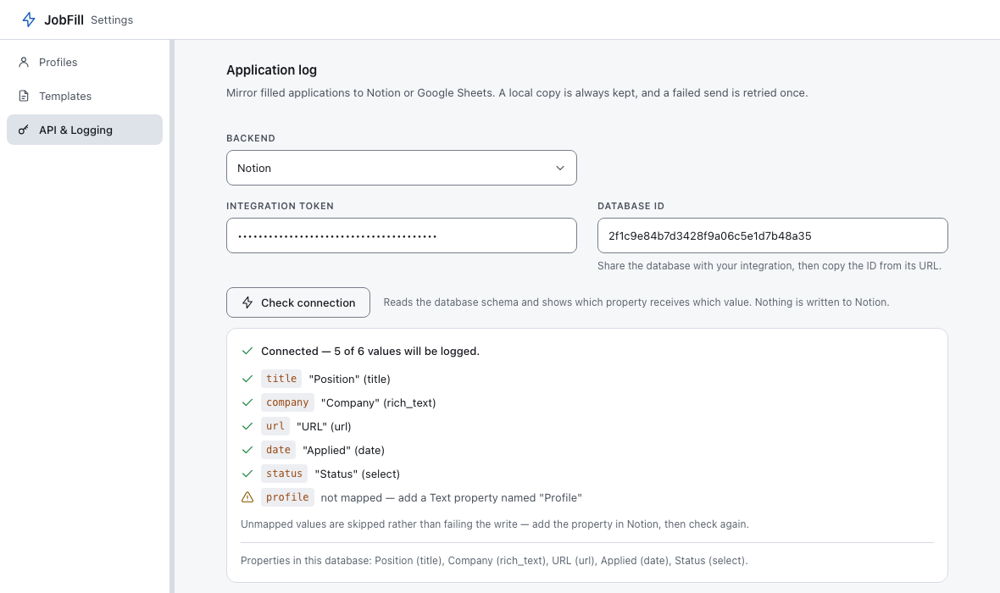
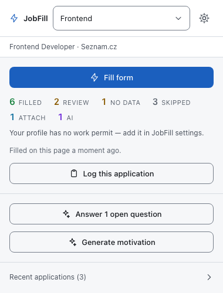

# Logging applications to Notion or Google Sheets

Every time you press **Log this application** in the popup, JobFill writes a
record of it. That record is *always* saved in the browser — the "Recent
applications" list at the bottom of the popup is it, and it needs no setup.

This page is about the optional second copy: mirroring the same record into a
Notion database or a Google Sheet, so your application tracker fills itself.

Settings → **API & Logging** → **Application log** → *Backend*.

| Backend | Setup effort | Needs |
|---|---|---|
| **Off** (default) | none | — |
| **Notion** | five minutes | A Notion integration token and a database |
| **Google Sheets** | fifteen minutes | A deployed Apps Script Web App |

Whatever you choose, **the local copy is written first and always.** A backend
that is down, misconfigured or rate-limited never costs you the record.

## What one record contains

| Field | Example | Where it comes from |
|---|---|---|
| Position | `Frontend Developer` | The posting's metadata |
| Company | `Seznam.cz` | The posting's metadata |
| URL | `https://www.jobs.cz/rpd/2000123456/…` | The tab's address |
| Date | `2026-08-15T09:41:02.318Z` | When you pressed the button |
| Status | `submitted` | Constant — JobFill cannot know whether you actually sent the form |
| Profile | the profile's internal id | The profile that was active |

Text fields are trimmed to 200 characters and the URL to 2000, so nothing
oversized reaches your database.

> **Known wart:** the *Profile* value is the profile's internal identifier (a
> UUID), not its label. It is stable and unique, but it is not "Frontend". If you
> only track one profile, leave that property out of your database entirely —
> unmapped values are skipped, not errors.

---

## Notion

### 1. Create the integration

1. Go to **<https://www.notion.so/my-integrations>** and press *New integration*.
2. Give it a name (`JobFill`), pick the workspace, and create it.
3. Copy the **Internal Integration Secret**. Modern tokens start with `ntn_`;
   older ones start with `secret_`. Both work — JobFill does not check the shape
   of this token.

### 2. Create the database and share it with the integration

Create a Notion database (a full-page one is easiest). It needs **at least a
Title property** — every Notion database has one by default, whatever it is
called.

Then share it with the integration, which is the step everybody misses:

> Open the database page → **•••** (top right) → **Connections** →
> *Connect to* → pick your integration.

Without this the token is valid and the database is invisible to it, and Notion
answers `404` — which JobFill reports as *"Notion could not find that database"*,
not as an authentication problem, because that is what it is.

### 3. Give it the properties you want filled

JobFill does **not** require a fixed schema. It reads your database and works out
which of your properties can hold which value, by type and by name. Nothing is
renamed and nothing is created.

| Value | Property types accepted | Names it looks for (case-insensitive, substring) |
|---|---|---|
| **title** *(required)* | Title | `name`, `title`, `position`, `role`, `pozice`, `název` |
| company | Text, Select, Title | `company`, `employer`, `organisation`, `organization`, `firma`, `společnost` |
| url | URL, Text | `url`, `link`, `posting`, `odkaz` |
| date | Date | `date`, `applied`, `datum`, `when` |
| status | Select, Status, Text | `status`, `stage`, `state`, `stav` |
| profile | Text, Select | `profile`, `profil`, `persona` |

If a name does not match but your database has exactly **one** property of the
right type, that one is used. So a Title property called `Úloha` is still found.

A recommended layout — this is what the screenshot below reads:

| Property | Type |
|---|---|
| `Position` | Title |
| `Company` | Text |
| `URL` | URL |
| `Applied` | Date |
| `Status` | Select |

Two type-specific notes:

- **Select** properties are safe: Notion creates a missing option automatically,
  so a `Status` select with no options at all still receives `submitted`.
- **Status** properties are not: the Notion API cannot create options for that
  type. If your Status property has no option literally called `submitted`, the
  value is skipped and the rest of the record is written normally. Add the option
  in Notion, or use a Select instead.

### 4. Paste both values and check

Back in Settings, choose **Notion** as the backend, paste the *Integration token*
and the *Database ID*.

**The database ID** is the 32-character string in the database's URL:

```
https://www.notion.so/myspace/2f1c9e84b7d3428f9a06c5e1d7b48a35?v=…
                              └────────── this ──────────────┘
```

Dashed form works too. If you use *Copy link* on the database page, everything
between the last `/` and the `?` is the id.

Then press **Check connection**:



The button reads the schema and shows you the mapping the *write* path will
use — one line per value. **Nothing is written to Notion.** It is safe to press
as often as you like, and each press re-reads the schema, so fixing a property
and checking again shows the fix rather than a cached failure.

Reading the result:

- **"Connected — 5 of 6 values will be logged."** Everything is fine. Unmapped
  values are skipped, not errors; the amber lines are suggestions.
- **A red line on `title`** — the database has no Title property JobFill can
  find, which is the one case that makes it unusable. Every Notion database has
  one, so this usually means the id points at something that is not a database
  (a page, or a *view* of a database in another workspace).
- **"Notion rejected the token"** — wrong secret, or the database was never
  shared with the integration. Do the *Connections* step again.
- **"Notion could not find that database"** — wrong id, or, again, not shared.

Finally: press **Save settings**. The check tests what you typed, not what is
stored.

---

## Google Sheets

There is no direct Sheets API here. JobFill posts to a **Google Apps Script Web
App that you deploy yourself**, which then writes the row. That is more work than
Notion, and it is the reason: a script you own needs no OAuth flow, no Google
Cloud project, and no third party holding a token to your spreadsheet.

### 1. Create the sheet and the script

1. Create a Google Sheet. Name the first sheet whatever you like.
2. **Extensions → Apps Script**.
3. Replace the contents of `Code.gs` with:

```javascript
function doPost(e) {
  var sheet = SpreadsheetApp.getActiveSpreadsheet().getSheets()[0];
  var entry = JSON.parse(e.postData.contents);

  if (sheet.getLastRow() === 0) {
    sheet.appendRow(['Date', 'Position', 'Company', 'URL', 'Status', 'Profile', 'Id']);
  }

  sheet.appendRow([
    entry.timestamp,
    entry.position,
    entry.company,
    entry.url,
    entry.status,
    entry.profileId,
    entry.id,
  ]);

  return ContentService
    .createTextOutput(JSON.stringify({ ok: true }))
    .setMimeType(ContentService.MimeType.JSON);
}
```

The request body is the record described [above](#what-one-record-contains), as
JSON, sent with `Content-Type: text/plain` — that is deliberate, because a JSON
content type triggers a CORS preflight that Apps Script cannot answer. Read it
with `e.postData.contents`, as here.

### 2. Deploy it as a Web App

**Deploy → New deployment → Select type → Web app**, then:

| Setting | Value | Why |
|---|---|---|
| Execute as | **Me** | The script writes to *your* sheet |
| Who has access | **Anyone** | The extension is not signed in as you; without this, Google answers with a sign-in page |

Press *Deploy* and authorise it (Google will warn about an unverified app — it is
your own script; *Advanced* → *Go to …*).

### 3. Copy the right URL

You are given a URL ending in **`/exec`**:

```
https://script.google.com/macros/s/AKfycb…long…/exec
```

**Use that one.** The Apps Script editor also shows a "test deployment" URL
ending in `/dev`. That one only works for the signed-in author, in a browser, and
will never work from the extension. JobFill refuses to save it:

> Use the deployment URL that ends with /exec (not /dev — that one is private to you).

The same inline check refuses `http://`, a URL that is not on `script.google.com`
/ `script.googleusercontent.com`, and anything that is not a URL. Save is blocked
until it is fixed, with a red note under the field and a second one next to the
button, so pressing Save never looks like it did nothing.

There is **no "Check connection" button for Sheets** — only this URL validation.
The first real proof is your first logged application.

### 4. Redeploy after every edit

Changing the script does not change the deployment. **Deploy → Manage deployments
→ ✎ → New version → Deploy**, and if the URL changes, update it in Settings.

### Why the extension also asks for `script.googleusercontent.com`

An Apps Script Web App *always* answers a POST with a redirect to
`script.googleusercontent.com`. Both hosts are therefore in the manifest: without
the second one, the request dies after the redirect and surfaces as an opaque
network failure. No separate data is sent to it — it is the same request,
following its own redirect.

---

## What happens when you press "Log this application"



The button appears once a fill has produced a summary. Pressing it:

1. Writes the local copy. This part cannot fail quietly — if it did, you get an
   error and no entry.
2. Tries the remote backend once, immediately.
3. Answers the popup with one of four states, shown as a sentence under the
   button and as a badge in the *Recent applications* list:

| Badge | Sentence | Meaning |
|---|---|---|
| `off` | Saved to your local application log. | No backend configured. This is a normal, final state. |
| `ok` | Saved and synced to your logging backend. | Done. |
| `pending` | Saved locally. Syncing to your backend… | The first attempt hit a timeout, a network error, a rate limit or an unreadable answer. It is queued. |
| `failed` | Saved locally — syncing to your backend failed. | A problem retrying cannot fix: bad credentials, missing database, wrong URL, schema rejected. |

A `pending` entry is retried **exactly once, about a minute later**, by an alarm
that survives the browser putting the extension to sleep. The popup re-reads the
log while it is open, so the badge changes under you from `pending` to `ok` or
`failed` without a reload. Credentials are re-read on the retry, so fixing a
wrong token within that minute is enough.

Only transport-level problems are retried. A rejected token is not going to be
accepted sixty seconds later, so it becomes `failed` straight away with a message
that says what to fix.

---

## Next

- [Using JobFill](using-jobfill.md)
- [Troubleshooting](troubleshooting.md)
