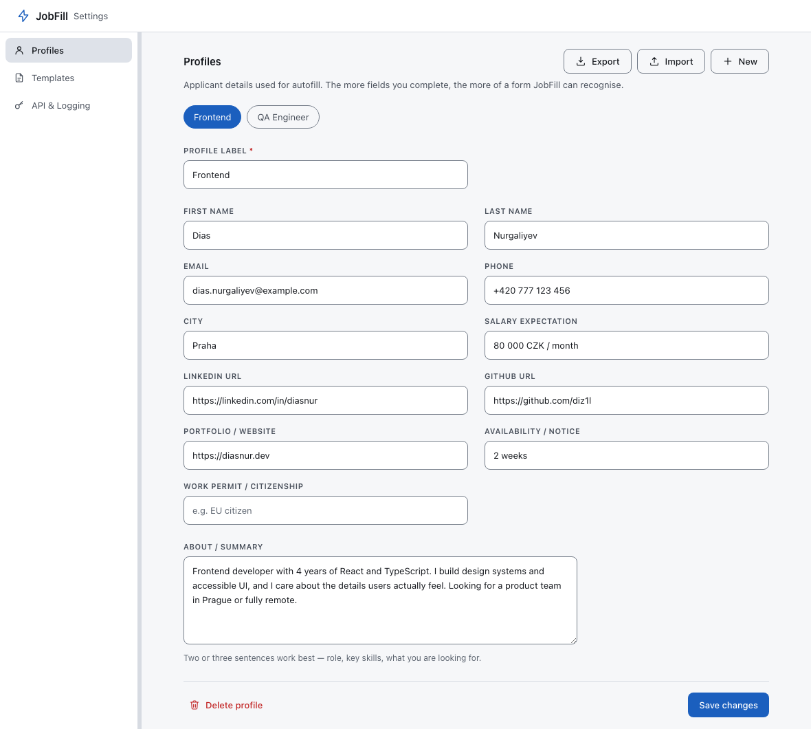
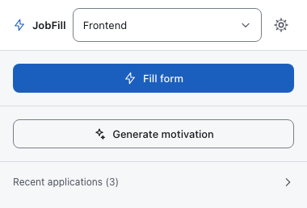
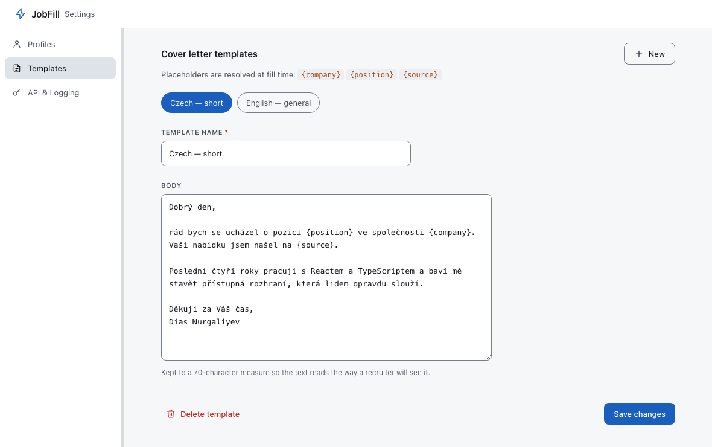

# First run — profiles and cover letters

Nothing can be filled until JobFill knows something about you. This page covers
the two things you set up once: a **profile** (the answers) and a **cover letter
template** (the long text). Both live in the settings page.

**Opening settings:** click the JobFill icon in the toolbar and press the gear
button in the top-right corner of the popup. It opens as a normal browser tab.
You can also reach it from `chrome://extensions` → JobFill → *Details* →
*Extension options*.

---

## 1. Create a profile

Settings → **Profiles**.



On a fresh install this tab shows an empty state with a *Create a profile*
button. Press it, fill in what you have, and press **Save changes** at the
bottom. Nothing is saved until you do.

### What every field is for

| Field | What a form asks it as | Notes |
|---|---|---|
| **Profile label** | — | Not sent anywhere. It is the name you pick this profile by, in the popup dropdown and on the pills at the top of this tab. |
| **First name** | *Jméno*, *First name*, *Given name*, *Křestní jméno* | |
| **Last name** | *Příjmení*, *Last name*, *Surname*, *Priezvisko* | |
| **Email** | *E-mail*, *Contact email* | |
| **Phone** | *Telefon*, *Phone*, *Mobil* | **Write it internationally: `+420 777 123 456`.** See below. |
| **City** | *Město*, *City*, *Location*, *Lokalita* | You may write `Praha, Czechia`; a field that asks only for a city then gets `Praha`, and one that asks for a location gets the whole string. |
| **Salary expectation** | *Platové očekávání*, *Expected salary* | Free text — `80 000 CZK / month`. A numeric-only input gets `80000`. |
| **LinkedIn URL** | *LinkedIn*, *LinkedIn profile*, *LinkedIn username* | Paste the full URL. A form asking for the bare handle gets `dias-nur`; one asking for a URL gets the URL. |
| **GitHub URL** | *GitHub* | Same treatment. |
| **Portfolio / Website** | *Website*, *Portfolio*, *Osobní web* | A field asking for a *domain* gets `diasnur.dev`, one asking for a URL gets `https://diasnur.dev`. |
| **Availability / Notice** | *Kdy můžete nastoupit?*, *Notice period*, *Available from* | Free text — `2 weeks`, `ihned`, `1. 9. 2026`. |
| **Work permit / Citizenship** | *Pracovní povolení*, *Work authorisation*, *Citizenship* | Free text — `EU citizen`. |
| **About / Summary** | *O mně*, *Tell us about yourself* | Two or three sentences. This is also the **only** thing the AI is given about you when it writes a motivation letter or answers an open question — see [How it works](how-it-works.md). |

### Which fields matter most

If you fill in nothing else, fill in these four: **first name, last name, email,
phone.** Together they are most of what an ordinary application form asks for,
and they are the fields JobFill recognises most reliably, because forms label
them consistently and often tag them with `autocomplete` attributes.

**About / Summary** is the next most valuable, but for a different reason: it is
not matched against form fields at all. It is the input to the AI features.
Without it, a generated motivation letter has nothing to work from except your
name.

Everything else is filled when a form happens to ask for it. An empty entry is
never a problem — the field is simply left blank and marked pink on the page so
you can see it was recognised and had nothing behind it.

### Why the phone number should start with `+`

JobFill stores one phone number and re-spells it for whatever the form wants:

| The form asks for | You get |
|---|---|
| an ordinary text field | `+420 777 123 456` |
| a separate *dial code* box | `+420` |
| nine digits, `pattern="[0-9]{9}"`, or *bez předvolby* | `777123456` |
| `<input type="number">` | `420777123456` (no `+`, which such inputs reject) |
| a field whose placeholder shows groups (`123 456 789`) | `+420 777 123 456` |

Splitting the country code off requires knowing where it ends, and the only way
to know is for the number to be written internationally — `+420…` or `00420…`. A
number stored as `777123456` is filled as-is everywhere, which is fine on a Czech
form and wrong on an international one.

### Storage limits

Profiles, templates and settings are kept in the browser's **synced** storage, so
they appear on your other signed-in browsers automatically. That storage is small
(about 100 KB in total, 8 KB per profile). If you get close, a warning appears at
the top of the Profiles tab at 80 % full, naming what to trim. In practice you
would need dozens of profiles or a very long *About* text to see it.

API keys are **not** synced — they are local to the browser you typed them into.
That is deliberate: see [Privacy](#what-is-and-is-not-in-an-export) below.

---

## 2. Several profiles

Press **New** in the top right of the Profiles tab to add another one. Use them
for genuinely different applications — a *Frontend* profile and a *QA* profile
with a different salary expectation and a different summary, for instance.

Profiles appear as pills above the form. Click one to edit it.

**Switching the active profile** is done in the *popup*, not here: when you have
more than one profile, the popup header turns into a dropdown. The profile
selected there is the one every fill uses — the button in the popup, the inline
button on the page, and the `Alt+Shift+F` shortcut alike.



With exactly one profile the dropdown is replaced by its name, because there is
nothing to choose.

---

## 3. Export and import

The **Export** button on the Profiles tab downloads a file called
`jobfill-export.json`. **Import** reads one back.

Use it to move your setup to another computer, to keep a backup before
experimenting, or to hand a colleague a starting point.

### What is and is not in an export

**In the file:** every profile, every cover letter template, which profile is
active, your settings (highlight duration, logging backend, the AI toggle), and a
`schemaVersion` number.

**Not in the file:** your API key, your Notion token, your Google Sheets URL, and
your application log. Those live in the browser's local storage and are
deliberately excluded — an export is a file you might email to yourself, and a
file that quietly contains a working credential is a bad idea. After importing on
a new machine, re-enter the key on the [API & Logging](ai-provider.md) tab.

### Import replaces, it does not merge

Importing **wipes the existing profiles and templates** and installs the ones
from the file. If you want to combine two setups, edit the JSON before importing.

Every import is validated before anything is written. Structural problems (the
file is not JSON, `profiles` is not a list, the `schemaVersion` is from a newer
build than yours) are refused outright with a message naming the offending part.
Smaller problems — a missing field, a value of the wrong type — are repaired, and
the green confirmation line says how many fields were repaired:

> *Imported 2 profile(s) and 2 template(s) · 3 field(s) repaired.*

---

## 4. Cover letter templates

Settings → **Templates**.



A template is the text JobFill pastes into a *Motivační dopis* / *Cover letter*
box. Press **New**, give it a name, write the body, press **Save changes**.

### Placeholders

Three placeholders are substituted at the moment a form is filled:

| Placeholder | Becomes | Where it comes from |
|---|---|---|
| `{company}` | `Seznam.cz` | The posting's own metadata — JSON-LD `JobPosting`, then Open Graph tags, then the page's headings |
| `{position}` | `Frontend Developer` | Same sources |
| `{source}` | `jobs.cz` | The **job board's** hostname, with `www.` removed — the site you are looking at, not the applicant-tracking system embedded in it |

They are case-insensitive: `{Company}` works too.

So a template written as

```
Dobrý den,

rád bych se ucházel o pozici {position} ve společnosti {company}.
Vaši nabídku jsem našel na {source}.
```

arrives in the form as

```
Dobrý den,

rád bych se ucházel o pozici Frontend Developer ve společnosti Seznam.cz.
Vaši nabídku jsem našel na jobs.cz.
```

You can see exactly that happening in the amber box of the
[example fill](using-jobfill.md#what-the-colours-mean).

If the posting does not publish its company or position in a machine-readable
form, the placeholder resolves to an empty string and the surrounding punctuation
is tidied up rather than left dangling. Check the text before you submit — which
you would anyway, because the field is highlighted amber for review.

### Only the first template is used

**JobFill fills the cover-letter field from the template at the top of the list.**
There is no per-application picker. If you keep several templates — a Czech one
and an English one, say — the first is the one that gets used; the others are
storage.

The list order is the order they were created in. To make a different template
the active one today, the reliable way is to edit the first template's body.

> The order can only be changed by editing the exported JSON and importing it
> back, which is a real gap and is worth knowing before you write four templates.

### The other way to get a letter

You do not have to use a template at all. With an AI provider configured, the
popup's **Generate motivation** button writes a letter for the specific posting
you are looking at, shows it to you in an editable box, and inserts it only when
you press *Insert into field*. See [Using JobFill](using-jobfill.md#generate-a-motivation-letter).

**Neither path ever writes text you have not seen.** If there is no template,
JobFill leaves the cover-letter box empty, outlines it pink, and tells you why —
it does not invent prose for a form an employer reads.

---

## Next

- **[Using JobFill](using-jobfill.md)** — you can start applying now; everything
  below this line is optional.
- [Connecting an AI provider](ai-provider.md) — for generated letters, answers to
  open questions, and better field recognition.
- [Logging applications to Notion or Google Sheets](application-log.md).
