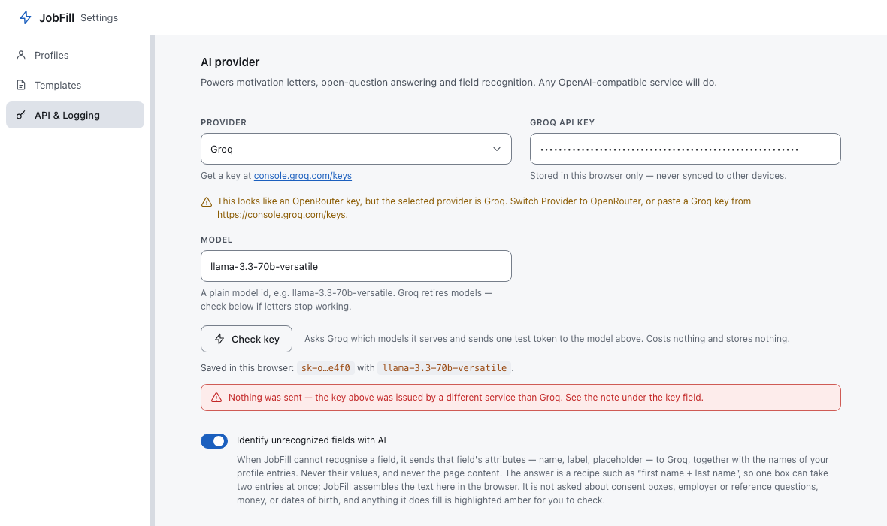

# Troubleshooting

Real failures, in roughly the order people hit them. Each one names the cause,
not just the symptom.

---

## Installation and the extension itself

### JobFill disappeared after I restarted Firefox

Expected. Firefox only allows an unsigned extension to be loaded as a **temporary
add-on**, which is removed when the browser quits. Load it again:
`about:debugging` → *This Firefox* → *Load Temporary Add-on…* →
`firefox-mv2/manifest.json`.

Your profiles, templates and settings are still there — the add-on id is fixed,
so Firefox hands the same storage back. Only the add-on itself has to be
reloaded.

If that is unacceptable, use a Chromium browser instead; there the install is
permanent. Full detail in [install.md](install.md#step-2b--firefox).

### JobFill disappeared in Chrome / the card shows an error

Chrome loads the extension from the folder on disk every time it starts. If you
moved, renamed, or deleted the `JobFill--main` folder — or emptied your Downloads
— the extension breaks. Put the folder back, or remove the broken card and
*Load unpacked* again from the new location.

### Chrome keeps offering to disable my developer-mode extensions

Unavoidable for anything not installed from a store, and JobFill is not published
in any store. Dismiss it; JobFill keeps working.

### Alt+Shift+F does nothing

Another extension registered that combination first, and the browser gives it to
whoever asked first — silently. Open `chrome://extensions/shortcuts`, find
JobFill, and set a different one. In Firefox: `about:addons` → gear →
*Manage Extension Shortcuts*.

### "JobFill's background worker did not answer"

Not about your key or your settings. The extension's background worker failed to
start, which usually means it needs a reload: `chrome://extensions` → the ↻ icon
on the JobFill card. Then try again.

---

## The AI provider

### "Invalid API key" — but the key is definitely right

**Nine times out of ten the Provider dropdown does not match the company that
issued the key.** A key from openrouter.ai sent to `api.groq.com` is invalid *at
Groq*, and Groq says so accurately and uselessly.

Open Settings → API & Logging and look at the two fields together. JobFill
recognises keys by prefix and warns as you type:

| Prefix | Provider to select |
|---|---|
| `gsk_` | Groq |
| `sk-or-v1-` | OpenRouter |
| `sk-proj-`, or a plain `sk-` | OpenAI |
| no prefix, bare hex | Together AI (nothing can be checked here) |
| `sk-ant-` | **None** — Anthropic's API is not OpenAI-compatible. JobFill cannot use it. |

Press *Check key* and, if it is a mismatch, the answer is **"Nothing was sent"** —
JobFill will not post one company's credential to another. Change the dropdown,
press *Check key* again, then press **Save settings**.

### "Check key" says the key is fine but the model is refused

Your key works. The model id does not — providers retire models regularly, and a
model id from one provider means nothing to another.

The card lists models you can use. Click one, then press **Save settings**. Or
just clear the Model field entirely: empty means "this provider's default", which
is always a valid id.

The card shows the provider's own words under the model line, so if it says
*"model has been decommissioned"* you know it is not you.

### I pasted the key but nothing works

Look at the line directly under the *Check key* button. If it says

> **No API key is saved in this browser yet.** Typing one above is not enough —
> press "Save settings" at the bottom.

…then that is the answer. Nothing on the API tab is saved as you type. There is
also an amber *"Unsaved changes — JobFill still uses the previously saved values"*
next to the Save button whenever you have edited something.

Note that **Check key can pass on a key that was never saved**: it deliberately
tests what you typed, so that you can verify a key before storing it.

### The masked key shown is not the one I just pasted

`gsk_…f6a7` is what JobFill is actually using. If those last four characters are
not the ones in your clipboard, you are looking at an older key that is still
saved. Paste the new one and press *Save settings*.

### I picked OpenRouter/OpenAI/Together and requests fail

Check whether the page is showing an **"Allow access to https://…"** button. Those
three providers are optional host permissions — the browser will not let JobFill
reach them until you grant the origin. Click the button and accept.

### My custom OpenAI-compatible endpoint does not work

The browser only lets an extension request permission for origins its manifest
already names, and JobFill deliberately does not ask for "all websites". So a
custom endpoint gets no host permission, and the request only succeeds if that
endpoint answers cross-origin requests permissively (`Access-Control-Allow-Origin`).
A self-hosted gateway you control can be configured to do that; a random public
API cannot.

Also check that the base URL is `https://`, has no query string, and does not
already end in `/chat/completions` — JobFill appends that itself.

---

## Filling

### Nothing happens at all on a page

Work down this list:

1. **Reload the tab.** JobFill's page script is injected at page load. A tab that
   was open before you installed or updated the extension does not have it. The
   popup says *"Could not reach this page. Reload the tab, then try again."* when
   this is the cause.
2. **Check the URL for an excluded word.** JobFill never runs on a URL containing
   `login`, `logon`, `signin`, `sign-in`, `password`, `checkout` or `payment`,
   **anywhere in it**. That includes a perfectly ordinary posting reached through
   `?utm_source=login`. It is a blunt rule, and it is the rule that keeps the
   extension off every sign-in page on the web. Workaround: strip the tracking
   parameter from the address and reload.
3. **Check the site.** Gmail, Google Accounts, Outlook, Microsoft login, PayPal
   and Stripe are excluded outright.
4. **Is it a regular web page?** `chrome://` pages, the Web Store, the PDF viewer
   and local files are off limits to every extension.
5. **Does the page look like a sign-in screen?** A form with a password field
   and at most five controls is treated as a login box, and its fields are never
   written into. When the whole page looks like that, the inline button is not
   armed at all. The popup button still works — it simply finds nothing it is
   allowed to fill.

   Note the deliberate exception: a *large* form with a password field is the
   "create an account while you apply" step of an applicant-tracking system. The
   surrounding name / email / CV fields are filled normally there; only the
   password itself is refused.

### The form is inside an iframe

That is fine and is handled — LinkedIn Easy Apply, Greenhouse and Workable
embeds all put the form in a frame, and the fill reaches every frame of the tab.

One caveat: on a page with several form frames, a frame that answers unusually
slowly still gets filled and highlighted, but its fields may be missing from the
**popup's counters**. Trust the highlights on the page over the numbers.

### A field stayed empty — and the outline tells you which problem it is

| Outline | Cause | Fix |
|---|---|---|
| 🩷 **Pink**, dashed | JobFill recognised the field and your profile has nothing for it. | Settings → Profiles, fill in that entry, press *Save changes*. The popup names it in words: *"Your profile has no work permit — add it in JobFill settings."* |
| ⬜ **Grey**, dashed | JobFill did not recognise the field. | Type it in. Then, please, [report the form](#a-form-jobfill-gets-wrong) — this is the single most useful thing you can send. |
| 🟦 **Blue**, dashed | It is a file input. Browsers do not let any extension attach a file. | Attach it yourself. |
| 🟪 **Purple**, dashed | It is an open question, not a data field. | Answer it, or use the popup's *Answer N open questions* button. |

### A field got the wrong value

Two known cases:

- **On a search-results page**, a "Minimum salary" filter box is filled with your
  salary expectation. By every signal available it *is* a salary field. Clear it
  and re-search.
- **A field belonging to someone else** — a referee's email, an emergency
  contact's phone — should be refused by the dictionary's negative rules. If one
  slipped through, that is a bug worth reporting with the exact label.

### The phone number came out in the wrong format

JobFill re-spells your stored number to fit the field: nine digits for
`pattern="[0-9]{9}"`, no `+` for a numeric input, grouped when the placeholder is
grouped. Splitting the country code off requires the stored number to be written
internationally. Store it as `+420 777 123 456`, not `777123456`.

### The cover letter was not inserted

- **Pink outline on the letter box, popup says "No cover letter template yet"** —
  you have no template. Settings → Templates → *New*. Or use the popup's
  *Generate motivation* button for a one-off letter.
- **Amber outline but the wrong template's text** — JobFill uses the **first**
  template in the list, always. There is no per-application picker. Edit the
  first template, or reorder them by editing an export file and importing it back.
- **"No cover letter field found. Click the field on the page, then insert
  again."** — this is *Insert into field* after *Generate motivation*. JobFill
  only inserts into a field it can justify, never into "the first textarea on the
  page". Click into the letter box on the page first, then press Insert.
- **`{company}` came out empty** — the posting does not publish its company in a
  machine-readable form (JSON-LD, Open Graph, or a heading). The surrounding
  punctuation is tidied rather than left dangling, but check the text before
  submitting.

### The popup is empty when I reopen it

A browser popup is destroyed the moment it loses focus, so JobFill stores the last
fill and restores it. That record is dropped when:

- more than **30 minutes** have passed;
- you navigated the tab to a different page (query strings and `#fragments` do not
  count as different);
- you are on a different tab.

A restored summary always says how old it is — *"Filled on this page 4 minutes
ago."* — so you never act on a stale one by accident.

---

## The application log

### It says "failed" immediately

A problem a retry cannot fix. The sentence under the button says which:

- **"Notion rejected the token"** — wrong integration secret, or the database was
  never shared with the integration (database page → **•••** → *Connections*).
- **"Notion could not find that database"** — wrong database id, or again not
  shared.
- **"The Notion database has no Title property"** — the id probably points at a
  page rather than a database.
- **"The Apps Script Web App requires sign-in"** — redeploy the script with
  *Who has access: **Anyone***.
- **"…is enabled but the token / Web App URL is missing"** — the backend is
  selected but not configured. Finish it, and press *Save settings*.

### It says "pending" and stays there

The first attempt hit a network problem, a timeout or a rate limit. JobFill
retries **once, about a minute later**, driven by an alarm that survives the
browser suspending the extension. The badge in *Recent applications* updates
itself from `pending` to `ok` or `failed` while the popup is open.

Credentials are re-read on the retry, so if you fix a wrong token inside that
minute, the retry succeeds.

### Google Sheets logs nothing and reports nothing

Check the URL first. It must end in **`/exec`**. The `/dev` URL that the Apps
Script editor also shows only works for you, signed in, in a browser — JobFill
refuses to save it, with the message *"Use the deployment URL that ends with
/exec (not /dev — that one is private to you)."*

Then check that you redeployed after your last script edit: **Deploy → Manage
deployments → ✎ → New version**. Editing the code does not change the live
deployment.

There is no "Check connection" button for Sheets, only the URL validation — the
first real proof is a logged application.

### A value is missing from my Notion page

Unmapped values are skipped rather than failing the write. Press
**Check connection** — it lists every value and the property it will go into, and
names what to add for the ones marked *not mapped*.

Special case: a **Status**-type property. The Notion API cannot create options for
that type, so unless an option called `submitted` already exists, that one value
is skipped. Add the option, or use a **Select** property instead — Notion creates
select options automatically.

---

## Settings and data

### "Synced storage is 8x % full"

The browser's synced storage is about 100 KB in total and 8 KB per profile.
Shorten a long *About* text, or delete a profile you do not use. Cover letter
templates count too.

### I imported a file and my profiles vanished

Import **replaces** the whole dataset; it does not merge. Import your own export
back to restore, or rebuild by hand.

### My API key was not in the export

Deliberate. Exports contain profiles, templates and settings only — never keys,
tokens or the application log. An export is a file you might email yourself, and a
file that quietly contains a working credential is a bad idea. Re-enter the key
after importing.

---

## A form JobFill gets wrong

This is the most useful bug report this project receives, and every real fix so
far has come from one. Two examples: the dictionary simply did not contain the
word `lokalita`, and a field whose only signal was its visible label did not reach
the fill threshold. Both were invisible from the inside and obvious from one
screenshot.

Open an issue at **<https://github.com/diz1l/JobFill-/issues>** with:

1. **The URL of the form** — or the job board's name if the posting has expired.
2. **Which field** went wrong, by its visible label — `Preferovaná lokalita`.
3. **What happened**: empty, wrong value, or filled when it should not have been.
4. **What colour it was outlined** — that alone tells us whether the matcher
   failed or your profile was empty.
5. Optionally, the field's markup: right-click the field → *Inspect* → right-click
   the highlighted line → *Copy* → *Copy outerHTML*.

Please do not paste your filled-in personal data into an issue.
