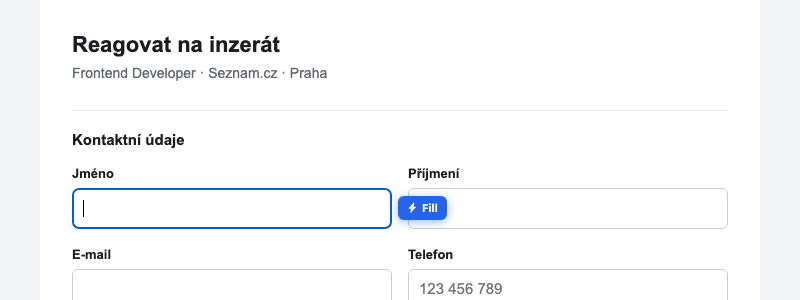
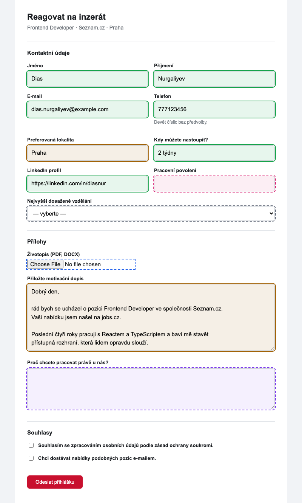

# Using JobFill

Open a job application form and use any of the three ways to fill it. They all do
exactly the same thing with the same profile.

| | How | Best for |
|---|---|---|
| **The popup** | Click the JobFill icon → **Fill form** | When you also want the summary, the AI buttons, or to log the application |
| **The inline button** | Click into any field of the form; a small blue **⚡ Fill** button appears beside it | The fastest path — no popup, no aiming at the toolbar |
| **The keyboard** | **Alt+Shift+F** | Hands already on the keyboard |

The inline button follows the field you are in and disappears when you leave it.
It lives in a closed shadow root, so the page cannot see it, style it, or read
anything from it — and it is never shown next to a password field or on a page
that looks like a sign-in screen.

**After installing or updating, reload the tab.** JobFill's page script is
injected when a page loads; a tab that was already open when you installed has no
JobFill in it and will answer *"Could not reach this page. Reload the tab, then
try again."*

---

## What happens on the page

Here is a real fill on a Czech application form — this image is produced by
running the shipped code, not drawn:

Every control JobFill looked at gets an outline for about three seconds. Click a
field to dismiss its outline early; they all clear themselves regardless.

### What the colours mean

| Colour | What it says | What to do |
|---|---|---|
| 🟩 **Green**, solid | Filled, and JobFill is confident. | Nothing. |
| 🟧 **Amber**, solid | Filled, but **check it**. Either the match was only moderately certain, or the value came from somewhere non-deterministic — a cover letter, or the AI classifier. | Read it before you submit. Cover-letter boxes are *always* amber, however certain the match was: it is generated prose going to an employer under your name. |
| ⬜ **Grey**, dashed | Not recognised. JobFill could not tell what this field is. | Type it yourself. |
| 🩷 **Pink**, dashed | **Recognised, and your profile has nothing for it.** | Fixable in settings — the popup names exactly which entry is missing. |
| 🟦 **Blue**, dashed | A file input. JobFill never fills these. | Attach the file yourself. |
| 🟪 **Purple**, dashed | An open-ended question — an essay box, not a data field. | Answer it, or use the popup's *Answer N open questions* button. |

The distinction between **grey** and **pink** is the one worth internalising,
because they look similar and lead to opposite actions:

- **Grey** = *"we did not understand this field."* Nothing in settings will help;
  the field's markup gave the matcher nothing to go on.
- **Pink** = *"we understood it perfectly and you have not told us the answer."*
  Open settings, fill in the entry, and it will be green next time.

That difference used to be invisible — a blank cover-letter box on a fresh
install was reported as "skipped", indistinguishable from a control JobFill could
not read, and the one thing the user could have done about it was never
mentioned. Now it has its own colour, its own counter, and a sentence naming the
missing item.

> The outlines are drawn on the job board's own inputs, so they have to stay
> visible on a page whose background JobFill cannot know. The six colours are
> picked to clear the WCAG 3:1 non-text contrast ratio against **both** white and
> near-black at once — the arithmetic is in
> [`shared/filler/highlight.ts`](../shared/filler/highlight.ts).

---

## What the popup tells you

The line above the button is the posting JobFill recognised — position and
company, read from the page's own metadata. It is the same information that goes
into `{position}` / `{company}` in your cover letter template and into the
application log.

### The counters

| Counter | Colour | Meaning |
|---|---|---|
| **filled** | green | Confidently matched and filled |
| **review** | amber | Filled, please read before submitting |
| **no data** | amber | Recognised, and your profile is empty there — the pink outlines |
| **skipped** | grey | Not recognised |
| **attach** | blue | File inputs found. Attach them yourself |
| **AI** | purple | Open questions found |

A counter that would be `0` is not shown at all, so a clean fill on a simple form
is just `4 FILLED`.

Under the counters, the **no data** number is spelled out in words, because it is
the only one you cannot see on the page — an empty field looks like an empty
field:

> *Your profile has no work permit — add it in JobFill settings.*
>
> *No cover letter template yet — add one in JobFill settings, or open JobFill to
> generate a letter for this job.*

If you reopen the popup after clicking back onto the page, the summary is still
there, labelled with its age (*"Filled on this page a moment ago."*). It is kept
for 30 minutes, per tab, and only for the page it was made on — navigate
elsewhere and it is gone rather than lying to you.

### If nothing was found

- *"No form fields found on this page."* — JobFill is running here and found
  nothing it could fill.
- *"Could not reach this page. Reload the tab, then try again."* — JobFill is not
  running in this tab. Reload it. If reloading does not help, see
  [Troubleshooting](troubleshooting.md#nothing-happens-at-all-on-a-page).
- *"JobFill only works on regular web pages."* — you are on a `chrome://` page,
  the Web Store, a PDF viewer or similar.

### Filling with the keyboard shortcut

`Alt+Shift+F` does not open the popup, so the result is reported two other ways:
the highlights on the page, and a **badge on the toolbar icon** for eight seconds
— the number of filled fields, green if anything was filled and red otherwise.
Hover the icon for the full breakdown. Everything the popup would have offered
afterwards, including *Log this application*, is still available if you open it.

---

## The AI buttons

These only appear once an [AI provider is configured](ai-provider.md).

### Generate a motivation letter

**Generate motivation** writes a 3–5 sentence paragraph for the specific posting
you are looking at, using its title, company, and the first 800 characters of its
description, plus your profile's *About* text. It writes in Czech if the posting
is in Czech, and in English otherwise.

The result appears **in an editable box inside the popup**. Read it. Change it.
Then press **Insert into field**, and only then does it reach the page.

The insert goes into a field JobFill can justify — the cover-letter box it
recognised during the fill, or the field you had focused before opening the popup
— never "the first textarea on the page", which is usually a search box or a chat
widget. If there is no such field, you are told so instead of the text
disappearing:

> *No cover letter field found. Click the field on the page, then insert again.*

### Answer open questions

When a form has essay-style questions (the purple outlines), the popup offers
**Answer N open questions**. It sends the questions, the role, the company and
your *About* text, and writes the answers straight into their own boxes — each
answer into the exact field, and the exact frame, its question came from.

Read them before submitting. They are drafts, in your name.

---

## Things JobFill will never do

These are deliberate, and they are not going to become options.

- **It never submits a form.** There is no code path that clicks a submit button.
- **It never touches a checkbox or a radio button.** That includes GDPR consent,
  "I agree to the terms", and newsletter opt-ins. Those are your statements to
  make, and an autofiller has no business making them. You can see both consent
  boxes in the screenshot above: untouched, and not even outlined.
- **It never fills a password field**, a one-time code, or a card number — by
  type, by `autocomplete` attribute, and by name, three independent checks.
- **It never attaches your CV.** Browsers do not allow an extension to put a file
  into a file input, and for good reason. JobFill outlines the input in blue and
  counts it under *attach* so you do not submit without it.
- **It never runs on sign-in, checkout or payment pages**, nor on Gmail, Outlook,
  Google Accounts, Microsoft login, PayPal or Stripe. It also declines to arm the
  inline button on any page that merely *looks* like a sign-in screen.
- **It never invents text.** A field it recognised and has no data for is left
  empty and flagged, not filled with something plausible.

---

## After you apply

Press **Log this application** in the popup to record it. With no further setup
that record lives in the browser and shows up under *Recent applications*; with
[Notion or Google Sheets configured](application-log.md) it is mirrored there too.

---

## Next

- [How it works](how-it-works.md) — what is actually deciding all this.
- [Troubleshooting](troubleshooting.md) — when it gets something wrong.
